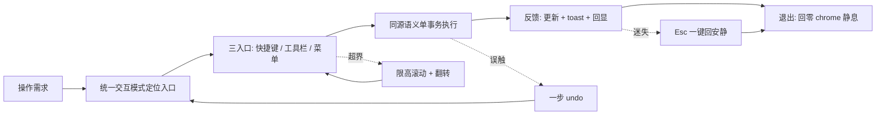
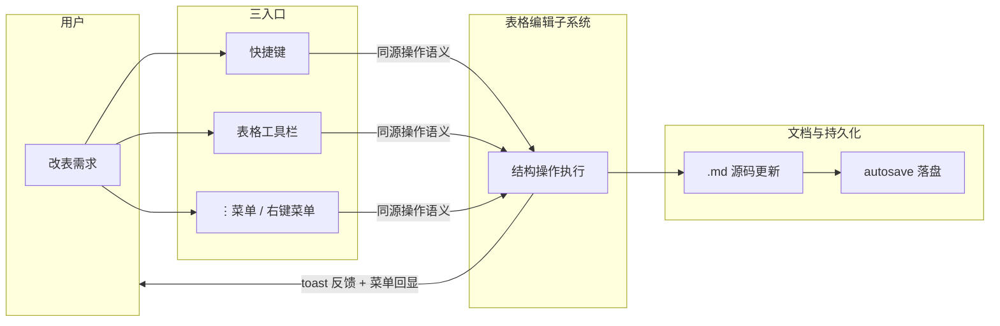
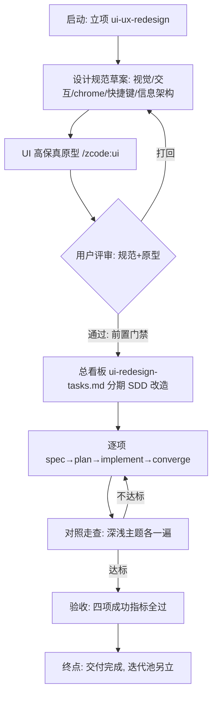
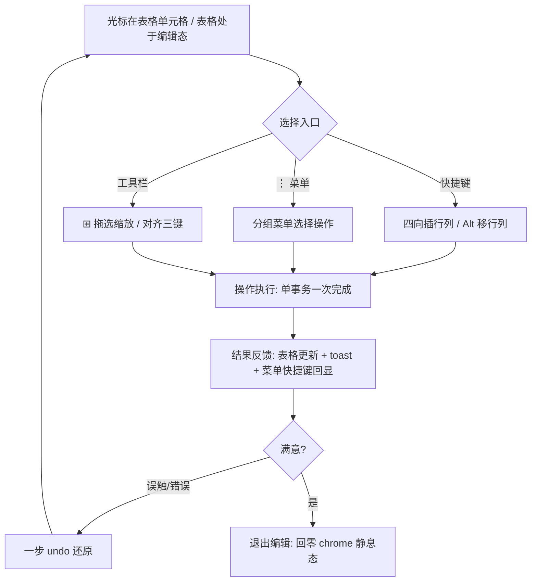
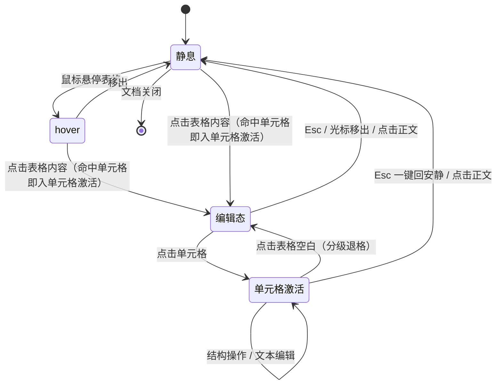
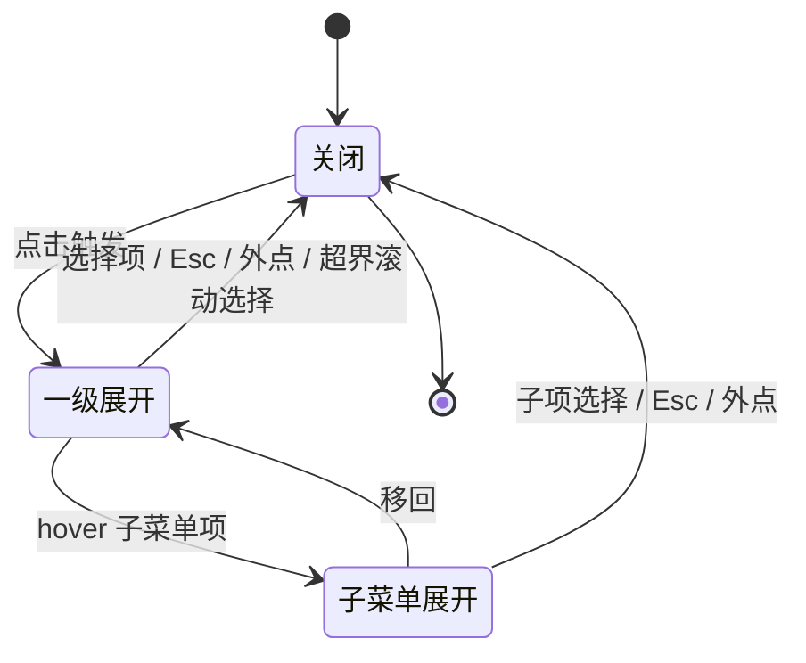

# VeloxMark UI/UX 全面交互重设计 PRD

## M01 文档元信息

| 项 | 内容 |
|---|---|
| 文档标题 | VeloxMark UI/UX 全面交互重设计需求文档（PRD） |
| 需求编号 | ui-ux-redesign |
| 版本 | v1.2（正式） |
| 状态 | 正式（核心闭环契约已冻结，评审基线） |
| 作者 | zhanghuanbiao + Claude |
| 场景类型 | C（旧需求改造） |
| 配套产物 | proposal.md / ac.md / prd/function-tree.md / prd/menu-tree.md / process-docs/TASK0001/requirement/support/user-perspectives/ |

### 术语定义

| 术语 | 定义 |
|---|---|
| VeloxMark | 本项目：类 Typora 的 Markdown 桌面阅读/编辑器，Markdown 源码为唯一数据源 |
| 实时预览 | 光标所在处显源码、其余处渲染的 CodeMirror 装饰式编辑形态 |
| 静息态 | 无 hover、无焦点、无浮层的界面常态，正文区域零控件 chrome |
| 块级 chrome | 块级渲染物（代码/公式/图/表格等）附带的操作控件簇，遵循四态显隐规范 |
| 双区编辑 | 公式/图表等复杂块进入编辑时上下双区（源码区上/预览区下）显示的编辑形态（原「并排」措辞校准，CHANGE-33；11A 已收敛契约布局不动） |
| 表格编辑工具栏 | 表格聚焦时浮现的顶部工具条（⊞ 网格选择器、对齐三键、⋮ 更多操作、删除） |
| 网格选择器 | 表格工具栏 ⊞ 按钮的行×列拖选弹层，用于缩放整表行列数 |
| 零布局抖动 | 编辑态进出、控件显隐不引起正文位置偏移（位移 0px）的体验标准 |
| 一键回安静 | Esc 或点击正文空白收拢全部浮层与编辑态、回到静息态的全局交互 |
| 同源操作语义 | 同一操作在快捷键/工具栏/⋮ 菜单/右键菜单四面的行为、反馈、禁用规则完全一致 |
| Shift 升档键位 | 快捷键族设计：Ctrl+Enter 为基础档，加 Shift 升档为反向/加强操作 |
| e2e 缝 | 自动化验收探针依赖的硬契约：window.__velox 系列、data-op、data-table-handle、命令 id |
| 现代极简风 | 本次设计语言：Notion（留白/内容优先/悬浮控件）× Linear（克制密度/快捷键驱动）双锚点 |
| 对照走查 | 按设计规范对全界面逐项人工核对的验收手段，深浅主题各一遍 |
| 总看板 | 本次改造的统一任务清单 ui-redesign-tasks.md（SDD 流程逐项推进） |

### 修订记录

| 日期 | 版本 | 变更人 | 变更内容 |
|---|---|---|---|
| 2026-09-28 | v0.1 | zhanghuanbiao + Claude | 草稿 3 块（需求概述/功能清单/业务流程与状态机）落盘，人工整体评审通过 |
| 2026-09-28 | v1.0 | zhanghuanbiao + Claude | 核心闭环契约冻结；补全 M01/M03a/M05/M09/M10/M11/M12/M13/M15/M16/M03b，转正式 |
| 2026-09-28 | v1.1 | zhanghuanbiao + Claude | Phase 6 契约对照评审修复：Esc 一键回安静对齐契约出口③（状态机直达静息）、菜单状态机选择项唯一归宿=关闭、表头保护禁用集收口、四面同源总则、⊞ 钳制语义、toast 两态文案、autosave 失败归宿、折叠记忆跨重启口径、M16 增补菜单树 3 裁决点；契约未变更 |
| 2026-09-28 | v1.2 | zhanghuanbiao + Claude | Phase 6 重审通过（P0=0）后 warn 落位：M03b AC-17 折叠口径对齐跨重启、6.1 移行对齐语义修正（移行时列对齐不变）、6.1 快捷键回显分母口径统一为「有快捷键的项」、5.1 补列宽显示态归属、M16 增补重审 warn 记录与待确认 #7~#10；契约未变更 |

## 1. 需求概述（M02）

### 1.1 需求背景

VeloxMark 功能已基本可用（菜单栏/左导航/渲染区），但前期未做 UI 规划即开发，界面是逐块"长"出来的：无统一设计语言，交互细节不专业。表格编辑尤甚——左侧留白、+/− 增删把手冗余、⋮ 下拉超出可视范围、⊞ 网格选择器空白、缺上下左右插行列快捷键。既有两套看板（refactor-tasks / markdown-ux-optimization）按元素逐点对齐，缺全局规范，已出现各自为战（11A 被迫额外收口）。需要以现代极简风（Notion×Linear 双锚点）对全界面交互做一次成体系重设计。

### 1.2 需求价值与目标

为写作者提供专业、安静、可预期的 Markdown 编辑体验：控件按需浮现、操作双通道（鼠标+键盘）可达、快捷键可发现。可量化目标：① 点名 5 缺陷全部清零并人工验收；②《UI/UX 设计规范》定稿 + UI 原型评审通过；③ 全界面按规范对照走查全部通过（深浅主题各一遍）；④ 结构操作菜单 100% 回显快捷键、块级可点击控件 hover 提示全覆盖。

### 1.3 业务场景

| 业务场景 | 一句话描述 |
|---|---|
| 表格评审改稿 | 评审后按意见在光标单元格上下左右插行列、移行列、改对齐 |
| 长文连续写作 | 连续输入不被 chrome 闪烁/布局跳动打断心流 |
| 复杂排版产出 | 公式/图表/代码块编辑时所见即所得、错误可修复 |
| 文档审阅小改 | 碎片时间扫读大纲/折叠章节，点进即改错字 |
| 首次试用 | 10 分钟内上手写作、从菜单/提示发现能力 |

### 1.4 用户角色概览

| 角色/系统 | 定义 | 核心职责 |
|---|---|---|
| 重度写作者 | 每日长文/技术文档写作 | 守住心流与截稿，编辑效率与快捷键是命脉 |
| 复杂排版用户 | 表格/公式/图表/代码重度使用者 | 高效产出体面文档，改表成本可控 |
| 阅读/审阅用户 | 碎片时间扫读 + 最小编辑 | 快速抓要点，阅读态安静、小改零门槛 |
| 新用户/轻度用户 | 首次试用决策 | 10 分钟内上手并发现能力边界 |
| VeloxMark（本地系统） | 桌面应用本体 | 提供渲染、编辑、持久化、导出 |

> 角色为使用场景视角（非权限概念，本应用无权限差异，见 M12）。

### 1.5 改动差距（现状 → 目标）

| 业务场景 | 现状 | 目标 | 差距追溯 |
|---|---|---|---|
| 表格评审改稿 | 无四向插行列快捷键；⋮ 菜单超界不可达；⊞ 网格选择器空白；+/− 把手冗余；表格左侧留白 | 五缺陷清零 + Shift 升档四向键位 + 四面同源 | 功能清单 P0 表格交互 5 项 |
| 长文连续写作 | chrome 闪烁、进出编辑态布局跳动、退出残留控件 | 静息零 chrome、进出编辑零布局抖动、退出无残留 | 全局交互"一键回安静" + 观感统一 |
| 复杂排版产出 | 弹层不可达、错误态弱、导出一致性靠人工 | 弹层完整可达、错误可修复、导出与编辑视图同步 | 表格/菜单可达性 + 导出联动 |
| 文档审阅小改 | 点击误入编辑态、大纲折叠不记忆 | 点击语义可预期、折叠会话记忆 | 渲染区交互 + 状态记忆 |
| 首次试用 | 快捷键不回显、控件不可发现 | 菜单 100% 回显快捷键、hover 提示全覆盖 | 菜单栏 + 可发现性要求 |

## 2. 验收策略声明（M03a）

| 维度 | 验收方向 |
|---|---|
| 验收方法论 | SDD 逐项 converge（typecheck + 单测 + e2e 缝不破坏）+ 人工冒烟 + 对照走查（深浅主题各一遍） |
| 缺陷清零 | 点名 5 缺陷逐项人工复现验收，全部清零才算达标 |
| 规范门禁 | 《UI/UX 设计规范》定稿 + UI 高保真原型评审通过后才允许动代码 |
| 可达性 | 全部下拉/弹层/子菜单在窗口边缘位置完整可达（限高滚动 + 边缘翻转） |
| 一致性 | 同一操作四面同源；快捷键提示与实际键位一致率 100%；导出三通道与编辑视图观感一致 |
| 可发现性 | 结构操作菜单快捷键回显率 100%；块级可点击控件 hover 提示覆盖率 100% |

> 具体 E2E 场景见 M03b。

## 3. 范围定义（M05）

| 范围 | 内容 | 边界说明 |
|---|---|---|
| In Scope | 《UI/UX 设计规范》定稿 + UI 高保真原型（前置门禁） | 含视觉原则/交互模式库/chrome 扩展/快捷键总表/信息架构 |
| In Scope | 表格五缺陷修复 + Shift 升档四向插行列快捷键 | 点名缺陷，P0 |
| In Scope | 顶部菜单栏信息架构重排 + 下拉防溢出 + 快捷键回显 | P0/P1 |
| In Scope | 左侧导航栏（文件树/大纲）统一审计改造与功能缺口补齐 | P1 |
| In Scope | 渲染区高收益交互（图片/链接/列表任务项/标题折叠）+ 公式/代码/mermaid 审计微调 | 高收益进核心，11.6-11.8 迭代池除外 |
| In Scope | 全局"一键回安静"（Esc/点空白收拢浮层与编辑态） | P0 |
| Out of Scope | 主题 token 体系重塑、全新配色体系 | 视觉仅跟随功能改造微调 |
| Out of Scope | 新 Markdown 语法支持（脚注 hover 等 11.6/11.7、hr 观感 11.8） | 迭代池另立需求 |
| Out of Scope | 移动端/触屏适配 | 桌面应用本需求不展开 |
| Out of Scope | 运营埋点/监控/宣发 | 桌面应用无运营需求（M17 不激活） |
| Out of Scope | 数据层改造（.md 唯一数据源不变、无新数据实体） | M08 不激活 |

## 核心闭环契约（评审基线 · 已冻结）

本需求的核心闭环是：**用户在改造后的界面中完成一次「内容/结构操作」并干净离场**——以表格结构操作（四向插行列）为代表锚点，同一闭环模式适用于菜单栏、左导航、渲染区各语法的所有交互改造。六要素基线：

| 要素 | 契约声明 |
|---|---|
| 触发 | 任一角色（重度写作者/复杂排版用户/阅读审阅用户/新用户）带着写作/改稿/阅读任务进入界面，产生一次具体操作需求（以"评审后在光标单元格右插列"为代表） |
| 主路径 | 操作需求 → 统一交互模式定位入口（hover 显控件 / 菜单 / 快捷键）→ 三入口之一（快捷键 / 表格工具栏 / ⋮ 或右键菜单）→ 同源操作语义单事务执行 → 即时反馈（表格更新 + toast + 菜单快捷键回显） |
| 结果 | 文档 .md 正确更新并 autosave 落盘；界面回到零 chrome 静息态；用户无学习成本地完成下一次同类操作 |
| 关键异常出口 | ① 误触/操作错误 → 一步 undo 还原；② 弹层超界不可达 → 限高滚动+边缘翻转保证全项可达；③ 用户迷失 → Esc/点空白"一键回安静"收拢全部浮层与编辑态 |
| 核心实体状态流转 | 界面交互态：静息 → hover → 编辑态 → 单元格激活 →（操作循环）→ 退出 → 静息；菜单：关闭 → 一级展开 →（子菜单展开）→ 关闭。任何路径终态必回静息/关闭，无悬空态 |
| 功能间映射 | 表格结构操作在快捷键/工具栏/⋮ 菜单/右键菜单四面同源（同 op、同 toast、同禁用规则）；菜单快捷键提示由快捷键总表单源派生；编辑视图变化同步导出侧（HTML/PDF/富文本）；视觉细节由设计规范统辖全部界面区域 |

## 4. 功能清单（M06）

| 模块 | 界面 | 按钮 | 核心功能点 | 状态(新增/修改/复用) | 优先级 | Kano |
|---|---|---|---|---|---|---|
| 设计规范 | — | — | 《UI/UX 设计规范》定稿（视觉原则/交互模式库/chrome 扩展/快捷键总表/信息架构） | 新增 | P0 | 基本型 |
| 设计规范 | — | — | UI 高保真原型评审通过（动代码前置门禁） | 新增 | P0 | 基本型 |
| 表格交互 | 表格编辑态 | （移除）+/− 把手 | 删除常驻把手与左侧留白，静息/编辑态均无把手带 | 修改 | P0 | 基本型 |
| 表格交互 | 表格工具栏 | ⊞ | 网格选择器正常显示、拖选缩放整表（修复空白） | 修改 | P0 | 基本型 |
| 表格交互 | 表格工具栏 | ⋮ 更多操作 | 下拉分组重排 + 限高滚动，全部项完整可达 | 修改 | P0 | 基本型 |
| 表格交互 | 表格编辑态 | 快捷键 | 光标单元格四向插行列（Ctrl+Shift+Enter 上插 / Ctrl+Enter 下插 / Ctrl+Shift+←/→ 左右插列） | 新增 | P0 | 期望型 |
| 表格交互 | 表格工具栏 | 对齐三键 / 🗑 | 保持既有能力，按新设计规范微调观感 | 复用 | P1 | 期望型 |
| 顶部菜单栏 | 菜单栏 | 全部菜单 | 信息架构重排（分组/命名/层级） | 修改 | P0 | 基本型 |
| 顶部菜单栏 | 下拉 / 子菜单 | — | 防溢出：限高滚动 + 边缘翻转，子菜单不丢失 | 修改 | P0 | 基本型 |
| 顶部菜单栏 | 下拉 | 菜单项 | 快捷键提示全量回显 | 修改 | P0 | 期望型 |
| 顶部菜单栏 | 菜单栏 | — | 视觉细节统一（间距/对齐/hover/激活态） | 修改 | P1 | 期望型 |
| 左侧导航栏 | 文件树/大纲 | — | 统一审计改造：视觉细节与布局行为优化 | 修改 | P1 | 期望型 |
| 左侧导航栏 | 文件树/大纲 | — | 功能缺口补齐（键盘导航/多选/大纲排序等按规范取舍） | 新增 | P1 | 期望型 |
| 渲染区 | 图片 | 编辑浮层 | 尺寸拖拽/对齐等编辑体验升级 | 新增 | P1 | 期望型 |
| 渲染区 | 链接 | hover 浮层 | URL 编辑/外开/复制直达 | 新增 | P1 | 期望型 |
| 渲染区 | 列表/任务项 | hover 微操作 | 行首拖拽把手 + 勾选微操作 | 新增 | P1 | 期望型 |
| 渲染区 | 标题 | 折叠三角 | 章节折叠 + 大纲联动 | 新增 | P1 | 期望型 |
| 渲染区 | 引用块 | 折叠/展开 | 长引用折叠为摘要行 | 新增 | P2 | 兴奋型 |
| 渲染区 | 公式/代码/mermaid | 各 chrome | 按新设计规范统一审计微调（不改已收敛契约） | 修改 | P1 | 基本型 |
| 全局交互 | 全界面 | Esc / 点空白 | 一键回安静：收拢全部浮层与编辑态 | 新增 | P0 | 基本型 |

> 本表为功能目录；业务规则细节见 M09。

## 5. 业务流程与状态机（M07）

### 5.1 业务实体

**角色/系统**：见 1.4 用户角色概览。

**核心数据实体**：

| 实体 | 核心字段 | 来源 |
|---|---|---|
| 文档（.md） | 正文文本（含表格/公式/图/代码源码） | 用户编辑，唯一数据源 |
| 表格结构 | 行、列、对齐、列宽（显示态） | 用户结构操作 |
| 会话/偏好 | 折叠态、侧栏布局、主题、标签页、列宽（显示态） | 用户使用积累 |
| 界面交互态 | chrome 四态、菜单开合、表格编辑会话 | 系统随交互产生 |

### 5.2 泳道图

> 表格结构操作跨界面面的多模块交互（三入口同源）。

### 5.3 交付主流程

> UI/UX 改造交付主流程（立项→交付，起点→终点闭环）。注意：本图是**交付流程**；用户操作端到端闭环见 5.4（契约主路径承载图）。

### 5.4 子流程图（契约主路径承载图 · 用户操作闭环）

> 核心闭环子流程：表格结构操作（三入口统一语义）。S1 前的"操作需求→统一交互模式定位入口（hover 显控件/菜单/快捷键）"段见 5.5 状态机（静息→hover→编辑态→单元格激活）、6.1 hover 显隐规范、6.4 点击语义裁决与 6.5 全局交互；undo 后落点为操作前状态、光标仍在锚定单元格。

### 5.5 状态机

> 实体 1：表格编辑会话。

> Esc 与点击正文语义（与契约出口③同源）：**Esc / 点击正文（含正文空白）从任意编辑态（含单元格激活）一次直达静息**，即"一键回安静"，非分级退出。判定边界：**表格空白** = 表格内未命中单元格的区域，仅作分级退格（单元格激活→编辑态）；**正文** = 表格以外的正文区域（含空白），点击即回静息。拖选/选区后松开视为选中复制，不触发编辑。

> 实体 2：下拉菜单（菜单栏/⋮/右键）。

### 5.6 主流程节点说明

| 节点 | 业务规则 |
|---|---|
| 设计规范草案 | 五部分必全：视觉原则/交互模式库/chrome 扩展/快捷键总表/信息架构；统辖全部界面区域 |
| 用户评审（门禁） | 规范 + 原型均通过才允许动代码；打回回草案迭代 |
| 总看板 SDD 改造 | 逐项 spec→plan→implement→converge；converge 恒为 typecheck + 单测 + e2e 缝不破坏 |
| 对照走查 | 按规范逐项人工核对，深浅主题各一遍；不达标回单项迭代 |
| 验收 | 四项成功指标（1.2）全过为终点；迭代池条目另立需求 |

## 6. 功能详细说明（M09）

> 每功能域按「入口 → 交互行为 → 业务规则」展开；e2e 缝（window.__velox 系列 / data-op / data-table-handle / 命令 id）为硬契约，任何改造不得破坏。除显式声明差异外，各功能域的反馈与恢复规格沿用核心闭环：操作 toast 回执、一步 undo、退出回零 chrome 静息态。

### 6.1 表格交互

**总则（四面同源）**：全部表格结构操作在快捷键/表格工具栏/⋮ 菜单/单元格右键菜单四面同源——同 op 语义、同 toast、同禁用规则；右键菜单 = ⋮ 菜单镜像（项集/分组/禁用/快捷键回显全同）。快捷键（四向插行列/移行列）**仅在表格单元格激活态生效，不劫持全局输入**；undo 入口为 Ctrl+Z / 编辑菜单撤销 / 操作回执 toast 撤销按钮并存，undo 后回到操作前状态、光标仍在锚定单元格。

| 功能点 | 入口 | 交互行为 | 业务规则 | 改动 |
|---|---|---|---|---|
| 移除 +/− 把手 | — | 删除常驻增删把手 | 静息/编辑态均无把手带；表格左缘与正文列对齐，水平偏移 0px；行列增删改由工具栏/菜单/快捷键承载 | 修改 |
| hover 显隐规范 | hover 表格 | hover 不显常驻 chrome | hover 态无常驻 chrome（内容纯阅读、可安全选中复制）；点击进编辑态后浮现表格编辑工具栏；细则随期 1《UI/UX 设计规范》交互模式库定稿 | 修改 |
| 四向插行列快捷键 | 键盘 | Ctrl+Enter 下插行；Ctrl+Shift+Enter 上插行；Ctrl+Shift+→ 右插列；Ctrl+Shift+← 左插列 | 锚定当前激活单元格（插在该单元格上/下/左/右，非表尾）；单事务一次完成；一步 undo 还原（含对齐/列宽钳制结果）；**表头保护禁用集合仅含：首行上移、首列左移**（Alt+↑/← 灰显），上插/左插在任意单元格均可用 | 新增 |
| 移行列（保持） | 键盘 | Alt+↑/↓ 移行；Alt+←/→ 移列 | 既有 STRUCT_KEYS 保持；表头保护同上（首行上移、首列左移禁用，菜单灰显）；**移列时对齐冒号随列同步迁移；移行时列对齐保持不变**；一步 undo 覆盖结构+对齐+列宽钳制结果 | 复用 |
| ⊞ 网格选择器 | 表格工具栏 | 点击展开行×列网格，拖选缩放整表 | 修复空白：网格单元格与弹层表面对比达标、清晰可辨；**20 行×12 列为网格控件可选上限，不缩减既有超出结构**（对 >20×12 表格 ⊞ 可选至现有行×列范围）；缩放含新增行/列的默认对齐（左对齐），删减方向从尾部移除 | 修改 |
| ⋮ 更多操作菜单 | 表格工具栏 | 下拉分组重排（行操作/列操作/对齐/结构删除） | 限高滚动 + 边缘翻转，窗口任意位置全项完整可达；有快捷键的项回显对应快捷键（无快捷键项右侧留空）；与右键菜单同源（见总则） | 修改 |
| 对齐三键 / 🗑 | 表格工具栏 | 左/中/右对齐；删除表格 | 对齐写入表格冒号行并即时回显；删除表格需确认框防误删，确认后一步 undo 可还原 | 复用 |
| 列宽（显示态） | 拖拽列边界 | 调整列宽 | 行列结构变化后旧列宽钳制到新结构，失效即重置而非错乱；**列宽为显示态、不写入 .md，不参与导出**（导出列宽由导出侧按内容自适应） | 复用 |

### 6.2 顶部菜单栏

| 功能点 | 入口 | 交互行为 | 业务规则 | 改动 |
|---|---|---|---|---|
| 信息架构重排 | 菜单栏 | 全部菜单项分组/命名/层级按设计规范 | 命令 id 不变（e2e 缝）；仅重排呈现；行业习惯优先（与 Typora/常见编辑器一致或更好） | 修改 |
| 下拉防溢出 | 下拉/子菜单 | 限高滚动 + 边缘翻转 | 下拉在窗口底部/右侧自动翻转；超高菜单内滚动，全部项可达；子菜单 hover 延展不丢失、不超界 | 修改 |
| 快捷键回显 | 下拉菜单项 | 每项右侧显示快捷键 | 有快捷键的命令回显率 100%；提示由快捷键总表单源派生，与实际键位一致率 100%（消除双源漂移） | 修改 |
| 视觉统一 | 菜单栏全量 | 间距/对齐/hover/激活态统一 | 由设计规范 token 统辖，不写裸值 | 修改 |

### 6.3 左侧导航栏

| 功能点 | 入口 | 交互行为 | 业务规则 | 改动 |
|---|---|---|---|---|
| 文件树/大纲审计改造 | 侧栏 | 视觉细节与布局行为优化 | 按设计规范对照走查逐项收敛；大纲 active 跟随滚动、点击平滑跳转不迷路 | 修改 |
| 折叠记忆 | 大纲/章节 | 折叠态持久记忆 | 折叠态写入本地偏好键，**跨重启持久，不写入 .md 正文** | 修改 |
| 功能缺口补齐 | 侧栏 | 键盘导航/多选/大纲排序 | 按规范取舍（Need Gate：去掉后核心用户能否完成核心任务）；取舍清单随规范定稿 | 新增 |

### 6.4 渲染区（Markdown 语法预览/编辑交互）

| 功能点 | 入口 | 交互行为 | 业务规则 | 改动 |
|---|---|---|---|---|
| 图片编辑浮层 | hover/点击图片 | 尺寸拖拽、对齐调整 | 编辑浮层按需浮现、退出干净；尺寸/对齐落 .md 语法（非显示态旁路） | 新增 |
| 链接 hover 浮层 | hover 链接 | URL 编辑、外开、复制 | URL 编辑写回 .md 链接语法（非显示态旁路）；外开只走系统默认浏览器打开固定入口；不外传用户可控串；复制为完整 URL | 新增 |
| 列表/任务项微操作 | hover 行首 | 拖拽把手排序；任务项勾选 | 把手 hover 才浮现、不常驻不遮挡正文；勾选写入 .md 任务语法 | 新增 |
| 标题折叠 | 标题左侧三角 | 章节折叠/展开 | 折叠含全部子章节；与大纲折叠**双向同步**（任一入口变更即更新另一处视图）；折叠态跨重启持久（同折叠记忆规则） | 新增 |
| 引用块折叠 | 长引用 | 折叠为摘要行 | 超阈值长度的引用可折叠，展开还原；P2，本期实现观感到标即可 | 新增 |
| 公式/代码/mermaid | 各块 chrome | 按规范统一审计微调 | 不改已收敛契约（11A 块级 chrome 四态/N1-N4）；双区编辑、错误态、跳源码能力保持；仅观感按新规范微调 | 修改 |
| 点击语义（裁决） | 全渲染区 | 点击内容进编辑；纯选中/复制不弹 chrome | 裁决：内容点击进入编辑（写作者路径优先）；**拖选/选区后松开视为选中复制，不触发编辑**；图/表/代码相邻处点击语义一致（内容点击进对应编辑形态） | 新增 |

### 6.5 全局交互

| 功能点 | 入口 | 交互行为 | 业务规则 | 改动 |
|---|---|---|---|---|
| 一键回安静 | Esc / 点击正文空白 | 收拢全部浮层与编辑态 | 覆盖菜单/popover/工具栏/双区编辑/chip；一次触发全部收拢（非逐个关闭）；收拢后焦点回正文；终态必为静息态 | 新增 |
| 误触防护 | 全局 | 操作后轻量 toast 告知 | 结构操作一步 undo；删表/删列等破坏性操作有确认；toast 自动消失、不打断输入 | 新增 |
| 静息态纯净 | 全局 | 零 chrome | hover 控件不闪烁（出入延迟防抖）、不遮挡正文、不引起布局抖动（位移 0px） | 新增 |

## 7. 关联与影响（M10）

| 关联模块/系统 | 依赖关系 | 联动改动 | 改动类型 |
|---|---|---|---|
| 导出子系统（HTML/PDF/富文本） | 编辑视图与导出渲染平行契约 | 设计规范定稿后的视觉调整需同步导出侧样式，导出物与编辑视图观感一致 | 修改（联动） |
| 主题 token（styles.css / exportCss / palette / hljsTokens） | 四处手工同步副本 | 改色必查全四处；本次仅微调不重塑 | 修改（联动） |
| 快捷键双源（命令注册表 / 原生菜单） | 快捷键与加速键手工同步 | 新增 Shift 升档键位须双源同步；菜单回显由总表派生 | 修改（联动） |
| i18n 文案（en/zh 双字典 + 原生菜单文案 + callout 标题） | 多处文案源 | 新增 UI 文案（toast/提示/菜单分组名）双语齐备、多源同步 | 新增（联动） |
| e2e 缝（cdp 探针脚本） | 硬契约依赖 | window.__velox 系列、data-op、data-table-handle、命令 id 全部保持；重构不得破坏 | 复用（硬契约） |
| 既有看板（refactor-tasks / markdown-ux-optimization） | 任务来源 | 收敛入总看板 ui-redesign-tasks.md；迭代池条目标注另立 | 修改（流程） |
| 状态栏统计 | 文档变更联动 | 表格结构操作后字数统计即时同步 | 复用 |
| 会话/偏好存储（localStorage） | 显示态持久化 | 新增偏好键（折叠态等）向后兼容，既有键位不变 | 修改（联动） |

## 8. 异常与边界（M11）

| 维度 | 场景 | 触发条件 | 系统行为 | 提示文案 | 恢复方式 |
|---|---|---|---|---|---|
| 数据异常 | 参差表格（行列数不齐）结构操作 | 对行列数不齐的表格插行/插列 | 按当前行/列实际结构补齐或保持参差不崩溃，操作结果与锚定单元格语义一致 | 无需提示（静默正确处理） | 结果异常时一步 undo |
| 数据异常 | 1×1 表格 / 删到最小表 | 对最小表格执行删行/删列 | 删至 1 行 1 列后继续删给出禁用（灰显）而非产生空表 | 无需提示（禁用态可见） | 不适用 |
| 数据异常 | 列宽失效 | 行列结构变化后旧列宽不适配 | 旧列宽钳制到新结构，超界即重置默认宽 | 无需提示 | 无需恢复 |
| 数据异常 | autosave 落盘失败 | 文件被占用/同步盘锁定导致自动保存失败 | 落盘报错，不静默丢稿，编辑内容保留在内存 | 「自动保存失败，文档可另存副本」 | 另存为可写副本 |
| 操作异常 | 误触结构操作 | 任意表格结构操作误执行（插/删/移行列/⊞ 缩放/对齐） | 单事务执行后可一步 undo | 两态文案：执行时 toast=操作回执（如「已插入列（Ctrl+Z 可撤销）」）；undo 后 toast=「已撤销」 | 一步 undo（Ctrl+Z / 编辑菜单撤销 / 操作回执 toast 撤销按钮并存；落点=操作前状态，光标仍在锚定单元格） |
| 操作异常 | 表头行误移 | 对首行执行上移 / 对首列执行左移 | 操作禁用（灰显），保持表结构语义 | 菜单项灰显即语义 | 不适用 |
| 操作异常 | 删表误触 | 点击 🗑 删除表格 | 弹确认框，确认才执行 | 「删除后可用一步撤销还原，确认删除该表格」 | 取消或 undo |
| 操作异常 | 弹层超界 | 任意下拉/弹层/popover（⋮ 菜单/右键菜单/⊞ 网格选择器/图片与链接浮层）在窗口边缘展开 | 限高滚动 + 边缘翻转，全部项完整可达（口径见 M03a 可达性） | 无需提示 | 不适用 |
| 权限异常 | 只读文件编辑 | 文件只读时执行编辑/结构操作 | 操作拦截，不产生半提交状态 | 「文件为只读，无法修改，可另存后编辑」 | 另存为可写副本 |
| 环境异常 | 窗口极窄/极小 | 窗口小于工具栏/菜单自然尺寸 | 布局自适应（换行/滚动/收紧），不裁切不可达 | 无需提示 | 调整窗口即恢复 |
| 环境异常 | 深浅主题对比不足 | 主题切换后块级渲染物/弹层 | 全部控件与文字对比度达标 | 无需提示 | 不适用 |
| 防错机制 | 组合 | — | 破坏性操作确认 + 一步 undo + 操作 toast + 禁用项灰显 + Esc 全收拢 | — | — |

## 9. 权限与敏感信息（M12）

**功能权限矩阵**：本应用为本机单用户桌面工具，四类角色为使用场景视角，无权限差异，全部角色对全部功能拥有同等操作权限。

| 角色 | 表格结构操作 | 菜单/快捷键 | 导出 | 偏好设置 | 文件 IO |
|---|---|---|---|---|---|
| 重度写作者 | 全部 | 全部 | 全部 | 全部 | 全部 |
| 复杂排版用户 | 全部 | 全部 | 全部 | 全部 | 全部 |
| 阅读/审阅用户 | 全部 | 全部 | 全部 | 全部 | 全部 |
| 新用户/轻度用户 | 全部 | 全部 | 全部 | 全部 | 全部 |

**敏感信息**：**不涉及**。本次为纯界面交互改造，不新增数据采集、不涉及个人信息/账号/支付/隐私字段；文档内容仅存本机，不经网络外传。

## 10. 非功能需求（M13）

| 维度 | 指标 | 目标值 |
|---|---|---|
| 性能 | 表格结构操作执行到视觉更新 | ≤ 100ms |
| 性能 | 下拉/popover 展开响应 | ≤ 200ms |
| 性能 | 装饰重建限定视口，20 页（约 2000 行）文档滚动 | ≥ 30fps |
| 性能 | hover 控件防抖（出入延迟） | ≥ 150ms，闪烁次数 0 |
| 可用性 | 进出编辑态正文水平/垂直位移 | 0px（零布局抖动） |
| 可用性 | 菜单快捷键提示与实际键位一致率 | 100% |
| 可用性 | 块级可点击控件 hover 提示覆盖率 | 100% |
| 可用性 | 下拉/弹层全项可达率（含窗口边缘位置） | 100% |
| 可用性 | 深浅主题下正文与控件文字对比度 | ≥ 4.5:1（WCAG AA） |
| 兼容 | 操作系统 | Windows 10/11 深浅主题全部达标 |
| 兼容 | 窗口尺寸 | 1280×768 至 4K 均完整可用 |
| 安全 | 既有安全基线 | contextIsolation/sandbox 保持开启；外部链接仅系统浏览器固定入口打开 |
| 数据迁移 | .md 唯一数据源 | 不变，无迁移 |
| 数据迁移 | 会话/偏好键位 | 既有键位不变，新增键向后兼容；回滚策略为保留旧键读取降级 |

## 11. 版本规划（M15）

| 分期 | 范围 | 里程碑 | 完成标志 |
|---|---|---|---|
| 期 1 规范与原型 | 《UI/UX 设计规范》定稿 + UI 高保真原型 | T+1 周 | 用户评审通过（前置门禁，未过不动代码） |
| 期 2 表格与全局 P0 | 表格五缺陷清零、Shift 升档四向快捷键、一键回安静 | T+2 周 | 5 缺陷人工验收清零 + typecheck/单测通过 |
| 期 3 菜单栏与左导航 | 信息架构重排、下拉防溢出、快捷键回显、左导航审计 | T+4 周 | 全下拉完整可达 + 回显率 100% |
| 期 4 渲染区 | 图片/链接/列表任务项/标题折叠 + 公式/代码/mermaid 审计 | T+6 周 | 高收益 4 项落地 + 审计清单清零 |
| 期 5 收口 | 对照走查（深浅主题各一遍）+ 四项成功指标验收 | T+7 周 | 四项成功指标全过；迭代池条目另立需求 |

## 12. 开放问题与风险（M16）

**待确认项**（确认后转陈述结论）：

| # | 事项 | 现状结论 | 责任人 | 预期确认时间 |
|---|---|---|---|---|
| 1 | 视觉微调的具体幅度 | 以 UI 高保真原型评审结论为准 | zhanghuanbiao | 期 1 原型评审 |
| 2 | 左导航功能缺口（键盘导航/多选/大纲排序）取舍清单 | 按 Need Gate 随设计规范定稿取舍 | zhanghuanbiao | 期 1 规范定稿 |
| 3 | 引用块折叠（P2）观感目标 | 本期实现到"可折叠可展开"即可 | zhanghuanbiao | 期 4 前 |
| 4 | Ctrl+Shift+T 键位冲突（重开标签页与切换主题双占） | 菜单树审查发现，须期 3 前裁决单一归属 | zhanghuanbiao | 期 3 动工前 |
| 5 | 缩放/开发者工具原生加速键与快捷键注册表双源漂移 | 菜单树审查发现，回显一致率须 100%，期 3 补注册或去加速键 | zhanghuanbiao | 期 3 动工前 |
| 6 | 删表确认文案现状与 M11 目标文案冲突 | 以 PRD M11 为准，实现时改写文案（现状提示"无法撤销"） | zhanghuanbiao | 期 2 动工前 |
| 7 | Ctrl+Shift+←/→ 与单元格内文本选区扩展（选词）键位冲突 | 重审发现，须裁决单一语义（如：存在文本选区时优先选区扩展、无选区时触发插列） | zhanghuanbiao | 期 2 动工前 |
| 8 | 删表确认框开启时 Esc/点空白叠加语义（取消确认框 vs 一键全收拢回静息） | 重审发现，须裁决单一归宿 | zhanghuanbiao | 期 2 动工前 |
| 9 | 操作回执 toast 含撤销按钮时的驻留时限/按钮可点窗口 | 重审发现，须定驻留规格（如 ≥5s 或 hover 暂停消失） | zhanghuanbiao | 期 2 动工前 |
| 10 | 删除行/列、对齐三键、⊞ 缩放、删表无键盘通道是否补齐 | 重审发现，按 Need Gate 与规范定稿裁决键位扩展或保持鼠标通道 | zhanghuanbiao | 期 3 动工前 |

**风险**：

| 风险 | 影响 | 缓解措施 |
|---|---|---|
| e2e 缝被破坏 | 自动化验收失效、回归盲区 | 硬契约清单入对照走查；每项 converge 必跑 cdp 冒烟 |
| 快捷键双源漂移 | 提示与实际键位不符（信任崩塌点） | 快捷键总表单源派生 + 单测锁定 |
| 主题色四副本漂移 | 导出与编辑视图色差 | 改色 checklist 全查四处同步 |
| 界面外壳文件继续膨胀 | 维护成本上升、回归风险 | 新逻辑放独立模块/hooks，不堆界面外壳 |
| 对照走查人手成本高 | 验收周期拉长 | 走查清单化、随期分期收敛、深浅主题各一遍 |

**评审改进清单**（Phase 6 warn 级建议的落位记录，均已随 v1.1 修复，不阻塞）：

| 建议来源 | 内容 | 落位 |
|---|---|---|
| 专家 1 | 子流程起点与契约主路径入口段衔接 | 5.3/5.4 重命名 + S1 前置注记 |
| 专家 1 | 表格 hover 态控件显隐未声明 | 6.1 hover 显隐规范行 |
| 专家 1 | 非表格场景闭环要素映射 | M09 总注（反馈/undo/退出规格沿用核心闭环） |
| 专家 2 | autosave 落盘缺验收断言 | AC-21 |
| 专家 2 | 误触 toast 分态、undo 入口、误触范围、弹层范围、autosave 失败、链接写回 | M11/M09 逐行修订 |
| 专家 3 | 表头保护句歧义、四面同源收口、移列对齐随列、快捷键作用域、⊞ 钳制、导出一致性、折叠持久化、点击判定 | 6.1/6.3/6.4/AC-22 逐项修订 |

**Phase 6 重审 warn 记录**（P0=0 通过后的 warn 级建议 17 条，落位如下，不阻塞）：

| # | 内容 | 落位 |
|---|---|---|
| 1 | 契约图与 5.4 图 undo 回跳节点映射未标注 | 5.4 已有落点注记；期 2 实现说明补节点等价注 |
| 2 | 轻量视图操作（折叠/勾选）是否回 toast 未显式声明差异 | ac.md 相关条目已无 toast 断言；差异声明随期 1 规范定稿 |
| 3 | Ctrl+Shift+←/→ 与文本选区扩展键位冲突未裁决 | 待确认 #7 |
| 4 | hover 显控件模式的域适用差异（表格 vs 图/链/列表） | 5.4 注记 + 6.1 hover 行已覆盖主干；差异表随期 1 规范定稿 |
| 5 | 契约结果「无学习成本完成下一次同类操作」验证口径 | 以可发现性代理指标映射（回显率 100% + hover 覆盖率 100% + 10 分钟上手场景），不新增 M03b 条目 |
| 6 | autosave 落盘失败验收侧悬空 | ac.md v1.1 补 AC-ERR-15 + 附录 B 登记 |
| 7 | 模态确认框开启时 Esc/点空白叠加语义 | 待确认 #8 |
| 8 | 图片/链接编辑操作缺显式 undo 断言 | ac.md AC-OP-13/14 补 undo 终态断言 |
| 9 | ⊞/图片/链接浮层窗口边缘可达缺场景级断言 | ac.md AC-ERR-13 扩展 + AC-RULE-10/AC-NF-08 兜底 |
| 10 | toast 含撤销按钮时驻留时限未声明 | 待确认 #9 |
| 11 | 折叠持久化口径 AC-17/ac.md 与 6.3 矛盾 | v1.2 修正（统一跨重启） |
| 12 | 「移行时对齐随行迁移」语义不成立 | v1.2 修正（移行时列对齐保持不变） |
| 13 | 快捷键回显分母口径不一致 | v1.2 修正（统一为「有快捷键的项回显」） |
| 14 | 导出一致断言未覆盖链接/列表/代码/mermaid | ac.md AC-OP-18 扩展覆盖 |
| 15 | 列宽显示态存储归属未声明 | v1.2 修正（5.1 会话/偏好实体补列宽字段） |
| 16 | 状态机「编辑态/单元格激活」双归宿边标注歧义 | 5.5 判定边界注记已覆盖；期 2 实现说明补注 |
| 17 | 删除行/列等无键盘通道缺口未裁决 | 待确认 #10 |

**假设前提**：

| 假设 | 若不成立的处置 |
|---|---|
| 现代极简风双锚点（Notion×Linear）解读在规范定稿后保持一致 | 规范评审阶段纠偏，评审后锚点不再变更 |
| 已收敛契约（11A 块级 chrome 四态、e2e 缝）不随本次视觉改造变更 | 若必须变更，先走 SDD 流程改契约再动实现 |
| 视觉仅跟随功能改造微调，不重塑 token 体系 | 超出微调幅度的诉求进迭代池另立 |

## 13. 验收标准详细（M03b）

> Given-When-Then 功能级 AC；与 M09 功能点一一对应。完整 AC 集见 ac.md。

| 编号 | Given | When | Then |
|---|---|---|---|
| AC-01 | 文档含表格，表格未聚焦 | 渲染静息态 | 表格左缘与正文列对齐（水平偏移 0px），无把手带、无常驻留白 |
| AC-02 | 表格处于编辑态 | 检查表格上下左右区域 | 静息/编辑态均无 +/− 增删把手 |
| AC-03 | 表格工具栏已浮现 | 点击 ⊞ 网格选择器 | 网格单元格清晰可辨（对比度达标），拖选 R×C 后整表缩放到 R 行 C 列 |
| AC-04 | 表格在窗口底部，工具栏 ⋮ 可点 | 点击 ⋮ 打开菜单 | 菜单限高滚动或边缘翻转，全部菜单项完整可达可点 |
| AC-05 | 光标位于表格第 i 行第 j 列激活单元格 | 按 Ctrl+Enter | 第 i 行下方插入空行，一步 undo 可还原 |
| AC-06 | 光标位于表格第 i 行第 j 列激活单元格 | 按 Ctrl+Shift+Enter | 第 i 行上方插入空行，一步 undo 可还原 |
| AC-07 | 光标位于表格第 i 行第 j 列激活单元格 | 按 Ctrl+Shift+→ | 第 j 列右侧插入空列，默认左对齐，一步 undo 可还原 |
| AC-08 | 光标位于表格第 i 行第 j 列激活单元格 | 按 Ctrl+Shift+← | 第 j 列左侧插入空列，默认左对齐，一步 undo 可还原 |
| AC-09 | 表格首行为表头 | 对首行按 Alt+↑（上移） | 操作不执行（禁用态），表头行保持首行 |
| AC-10 | 任意结构操作已执行 | 检查 toast 与对应菜单 | toast 告知操作结果；⋮/右键菜单对应项回显实际快捷键 |
| AC-11 | 顶部菜单栏任一菜单展开 | 检查全部菜单项 | 有快捷键的命令 100% 显示提示，且提示与实际键位一致 |
| AC-12 | 下拉菜单在窗口右/下边缘展开 | 展开含子菜单的长菜单 | 菜单自动翻转或内滚动，子菜单不丢失、不超出可视范围 |
| AC-13 | 界面同时存在多个浮层/编辑态（含表格单元格激活态） | 按 Esc 或点击正文空白 | 全部浮层与编辑态一次收拢（非分级退出），界面回零 chrome 静息态 |
| AC-14 | 表格在编辑态且有工具栏浮现 | 点击正文其他段落 | 表格退出编辑，无残留把手/工具栏/高亮（回静息） |
| AC-15 | 删表操作已触发 | 点击 🗑 删除表格 | 弹确认框；确认删除后一步 undo 可还原整表 |
| AC-16 | 含图片/链接/列表/标题的文档 | hover 对应元素 | 浮层/微操作按需浮现，不遮挡正文、不引起布局抖动（位移 0px） |
| AC-17 | 标题有子章节 | 点击标题折叠三角 | 章节含子章节折叠为单行，与大纲折叠状态双向同步一致，折叠态写入本地偏好键、跨重启持久，且不写入 .md 正文 |
| AC-18 | 深色主题与浅色主题各一遍 | 全界面按设计规范对照走查 | 全部条目达标，正文与控件文字对比度 ≥ 4.5:1 |
| AC-19 | 文件为只读 | 尝试表格结构操作 | 操作拦截并提示只读，可另存为可写副本 |
| AC-20 | 完成任意表格结构操作 | 导出 HTML/PDF/富文本 | 导出物中表格行列/对齐与编辑视图一致 |
| AC-21 | 表格结构操作已执行 | 自动保存完成 | .md 源码含本次变更、状态栏显示已保存、无未保存丢失 |
| AC-22 | 公式/任务项/图片编辑后 | 导出 HTML/PDF/富文本 | 导出物中对应内容与编辑视图一致（列宽为显示态不参与导出） |
