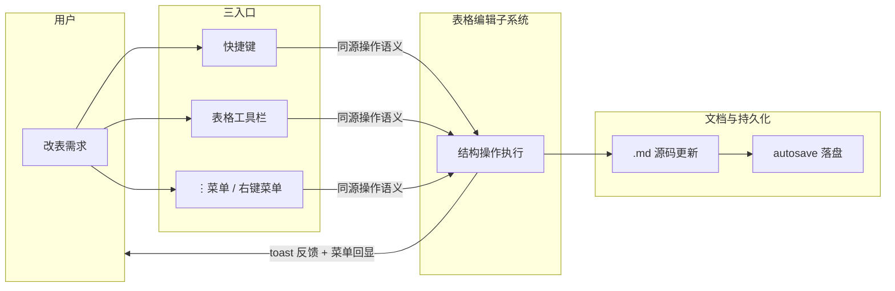
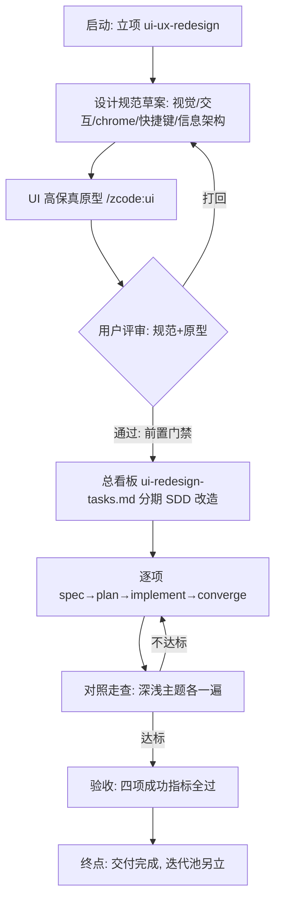
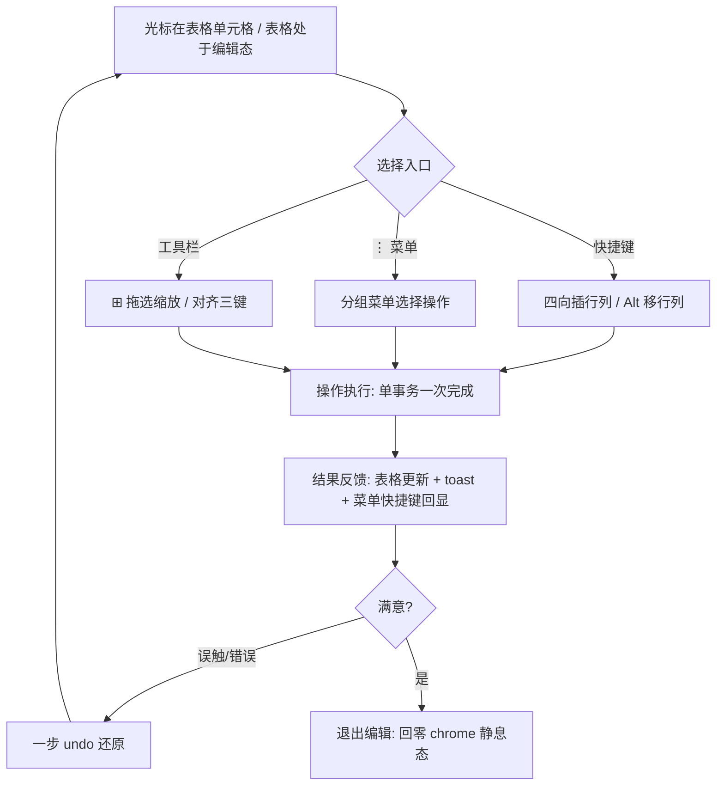
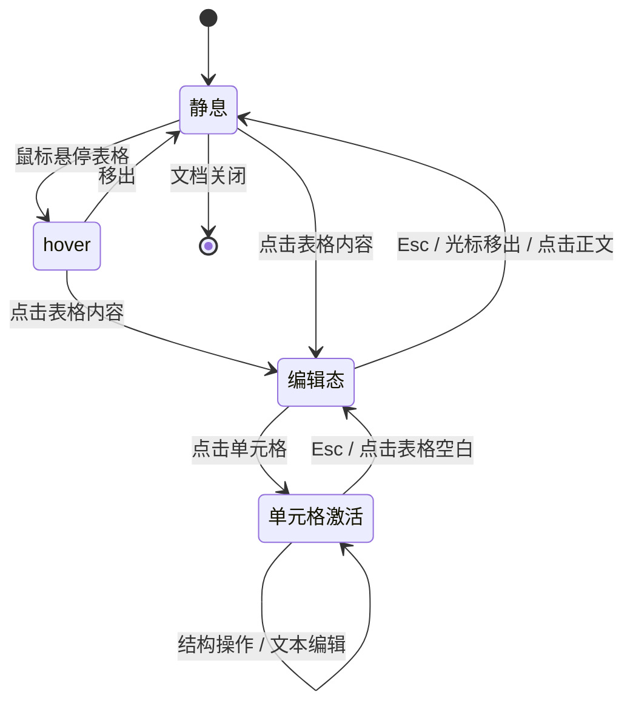
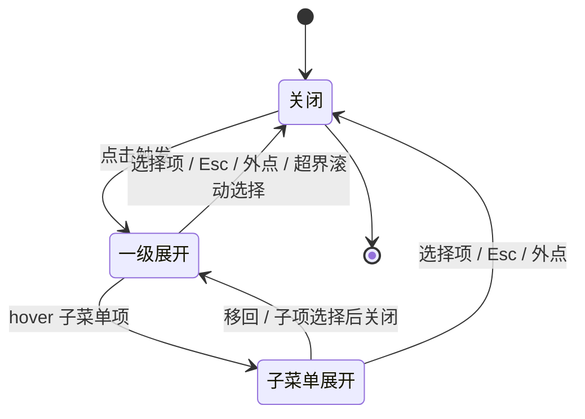

# PRD.md（草稿版）

> 草稿 = 骨架完整、内容简短。本文件与正式 PRD 同一文件演进：人工整体 review 通过后，Phase 5 在本文件基础上补全为正式 PRD。
> 状态：草稿 | 版本：v0.1 | 作者：zhanghuanbiao + Claude | 需求：ui-ux-redesign

## 1. 需求概述

### 1.1 需求背景

VeloxMark 功能已基本可用（菜单栏/左导航/渲染区），但前期未做 UI 规划即开发，界面是逐块"长"出来的：无统一设计语言，交互细节不专业。表格编辑尤甚——左侧留白、+/− 增删把手冗余、⋮ 下拉超出可视范围、⊞ 网格选择器空白、缺上下左右插行列快捷键。既有两套看板（refactor-tasks / markdown-ux-optimization）按元素逐点对齐，缺全局规范，已出现各自为战（11A 被迫额外收口）。需要以现代极简风（Notion×Linear 双锚点）对全界面交互做一次成体系重设计。

### 1.2 需求价值与目标

为写作者提供专业、安静、可预期的 Markdown 编辑体验：控件按需浮现、操作双通道（鼠标+键盘）可达、快捷键可发现。可量化目标：① 点名 5 缺陷全部清零并人工验收；②《UI/UX 设计规范》定稿 + UI 原型评审通过；③ 全界面按规范对照走查全部通过（深浅主题各一遍）；④ 结构操作菜单 100% 回显快捷键、块级可点击控件 hover 提示全覆盖。

### 1.3 业务场景

| 业务场景 | 一句话描述 |
|---|---|
| 表格评审改稿 | 评审后按意见在光标单元格上下左右插行列、移行列、改对齐 |
| 长文连续写作 | 连续输入不被 chrome 闪烁/布局跳动打断心流 |
| 复杂排版产出 | 公式/图表/代码块编辑时所见即所得、错误可修复 |
| 文档审阅小改 | 碎片时间扫读大纲/折叠章节，点进即改错字 |
| 首次试用 | 10 分钟内上手写作、从菜单/提示发现能力 |

## 2. 功能清单

| 模块 | 界面 | 按钮 | 核心功能点 | 状态(新增/修改/复用) | 优先级 |
|---|---|---|---|---|---|
| 设计规范 | — | — | 《UI/UX 设计规范》定稿（视觉原则/交互模式库/chrome 扩展/快捷键总表/信息架构） | 新增 | P0 |
| 设计规范 | — | — | UI 高保真原型评审通过（动代码前置门禁） | 新增 | P0 |
| 表格交互 | 表格编辑态 | （移除）+/− 把手 | 删除常驻把手与左侧留白，静息/编辑态均无把手带 | 修改 | P0 |
| 表格交互 | 表格工具栏 | ⊞ | 网格选择器正常显示、拖选缩放整表（修复空白） | 修改 | P0 |
| 表格交互 | 表格工具栏 | ⋮ 更多操作 | 下拉分组重排 + 限高滚动，全部项完整可达 | 修改 | P0 |
| 表格交互 | 表格编辑态 | 快捷键 | 光标单元格四向插行列（Ctrl+Shift+Enter 上插 / Ctrl+Enter 下插 / Ctrl+Shift+←/→ 左右插列） | 新增 | P0 |
| 表格交互 | 表格工具栏 | 对齐三键 / 🗑 | 保持既有能力，按新设计规范微调观感 | 复用 | P1 |
| 顶部菜单栏 | 菜单栏 | 全部菜单 | 信息架构重排（分组/命名/层级） | 修改 | P0 |
| 顶部菜单栏 | 下拉 / 子菜单 | — | 防溢出：限高滚动 + 边缘翻转，子菜单不丢失 | 修改 | P0 |
| 顶部菜单栏 | 下拉 | 菜单项 | 快捷键提示全量回显 | 修改 | P0 |
| 顶部菜单栏 | 菜单栏 | — | 视觉细节统一（间距/对齐/hover/激活态） | 修改 | P1 |
| 左侧导航栏 | 文件树/大纲 | — | 统一审计改造：视觉细节与布局行为优化 | 修改 | P1 |
| 左侧导航栏 | 文件树/大纲 | — | 功能缺口补齐（键盘导航/多选/大纲排序等按规范取舍） | 新增 | P1 |
| 渲染区 | 图片 | 编辑浮层 | 尺寸拖拽/对齐等编辑体验升级 | 新增 | P1 |
| 渲染区 | 链接 | hover 浮层 | URL 编辑/外开/复制直达 | 新增 | P1 |
| 渲染区 | 列表/任务项 | hover 微操作 | 行首拖拽把手 + 勾选微操作 | 新增 | P1 |
| 渲染区 | 标题 | 折叠三角 | 章节折叠 + 大纲联动 | 新增 | P1 |
| 渲染区 | 引用块 | 折叠/展开 | 长引用折叠为摘要行 | 新增 | P2 |
| 渲染区 | 公式/代码/mermaid | 各 chrome | 按新设计规范统一审计微调（不改已收敛契约） | 修改 | P1 |
| 全局交互 | 全界面 | Esc / 点空白 | 一键回安静：收拢全部浮层与编辑态 | 新增 | P0 |

> 只列清单，不写字段细节、不写业务规则（属正式 M09）。

## 3. 业务流程与状态机

### 3.1 业务实体

**角色/系统**：

| 角色/系统 | 职责 |
|---|---|
| 重度写作者 | 每日长文/技术文档写作，编辑效率与快捷键是命脉 |
| 复杂排版用户 | 表格/公式/图表/代码重度使用者，结构操作与导出一致是核心 |
| 阅读/审阅用户 | 碎片时间扫读 + 最小编辑，要求阅读态安静 |
| 新用户/轻度用户 | 首次试用决策，要求可发现性与行业习惯一致 |
| VeloxMark（本地系统） | 提供渲染、编辑、持久化、导出 |

**核心数据实体**：

| 实体 | 核心字段 | 来源 |
|---|---|---|
| 文档（.md） | 正文文本（含表格/公式/图/代码源码） | 用户编辑，唯一数据源 |
| 表格结构 | 行、列、对齐、列宽（显示态） | 用户结构操作 |
| 会话/偏好 | 折叠态、侧栏布局、主题、标签页 | 用户使用积累 |
| 界面交互态 | chrome 四态、菜单开合、表格编辑会话 | 系统随交互产生 |

### 3.2 泳道图

> 表格结构操作跨界面面的多模块交互（三入口同源）。

### 3.3 主流程图

> UI/UX 改造交付主流程（起点→终点闭环）。

### 3.4 子流程图

> 核心闭环子流程：表格结构操作（三入口统一语义）。

### 3.5 状态机

> 实体 1：表格编辑会话。

> 实体 2：下拉菜单（菜单栏/⋮/右键）。

