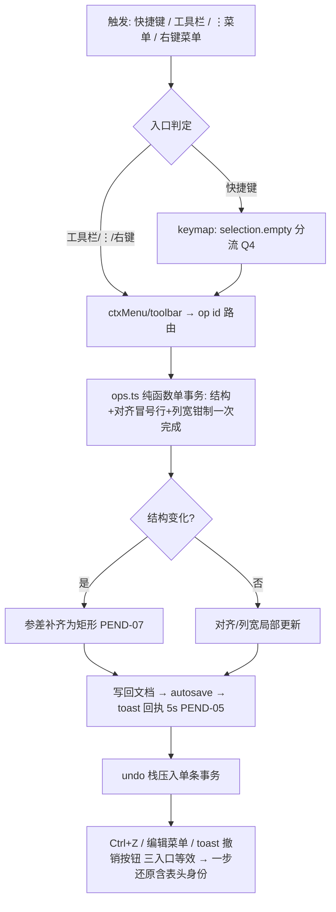
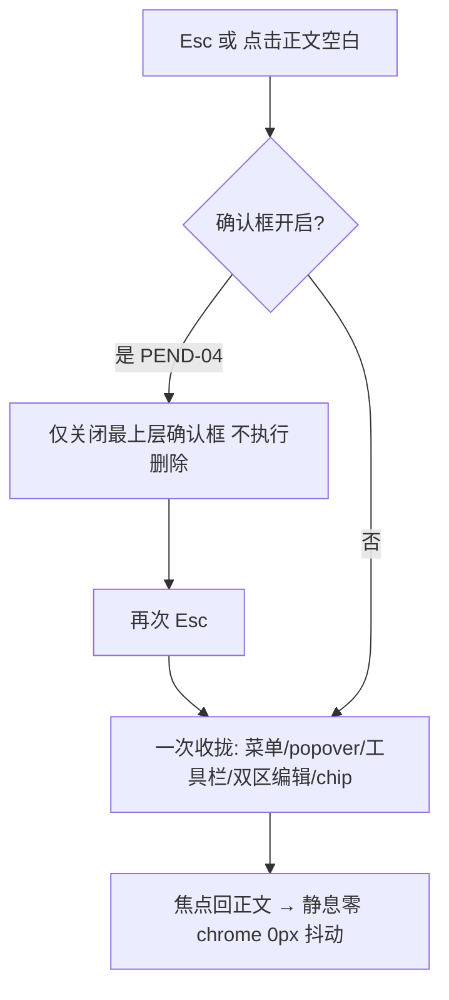
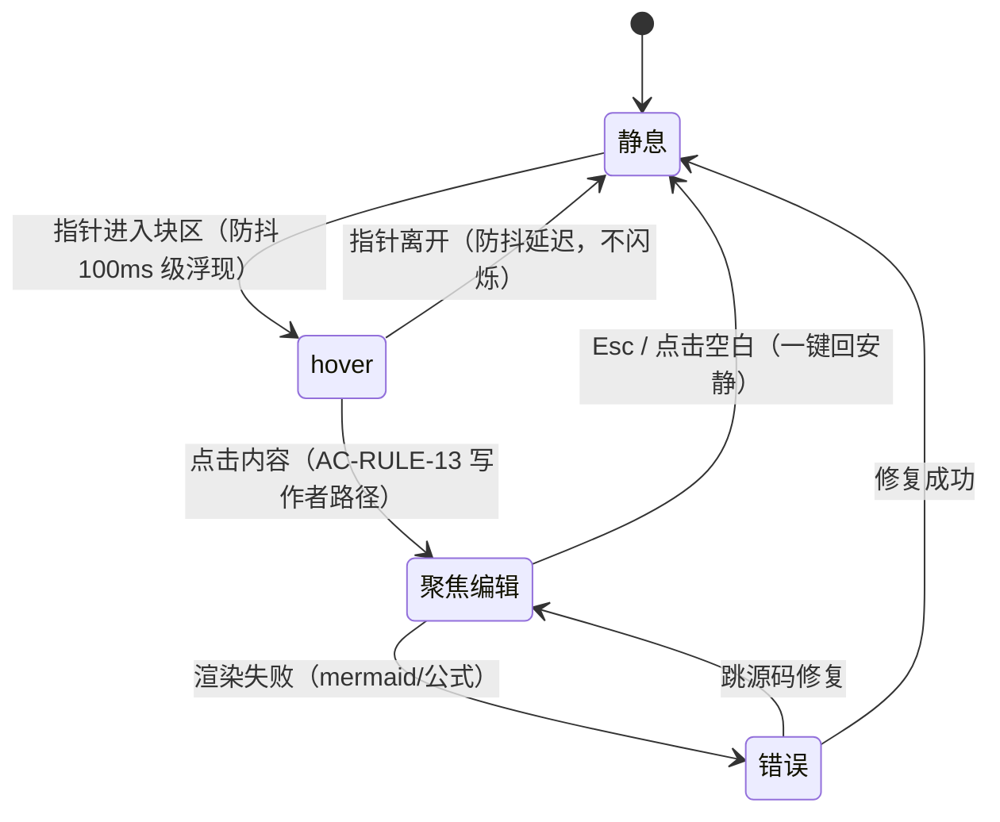

# VeloxMark UI/UX 全面交互重设计 技术方案

> 需求编号：ui-ux-redesign ｜ 模式：标准模式（prd 存在）｜ 扩展性预判：**通用能力**（`design/adr/extensibility.md`）
> 裁决真源：[`design/adr/grill-rulings.md`](adr/grill-rulings.md)（grill-me 13 项，2026-09-28 全部锁定）｜ 难逆 ADR：[`e2e-contract-delta.md`](adr/e2e-contract-delta.md)
> 桌面端适配口径（全案一致）：本仓无 HTTP 后端/无 MySQL，「API 接口」映射为**命令契约/IPC/localStorage 契约面**，「DB」映射为 **localStorage 双键 schema**，「微服务划分」映射为**双进程模块划分**。列名沿用模板，单元格取桌面等价值。

## 1. 需求概述

以《UI/UX 设计规范》+ 7 页高保真原型为判据，对 VeloxMark（Electron + React 19 + CodeMirror 6 的 Markdown 桌面编辑器，Markdown 源码为唯一数据源）做全界面交互重设计：期 2 表格与全局 P0（去把手、Shift 升档键位、同源三入口、toast+undo、零 chrome）、期 3 菜单栏与左导航（信息架构重排、快捷键回显单源、键盘通道补齐）、期 4 渲染区（图/链/列表/标题/引用块浮层与折叠）。命令 id、`data-op`、`window.__velox*` e2e 缝为自动化硬契约（有登记的演进除外，见 §3）。

### 1.1 现有代码基础

> 桌面适配：按渲染进程/主进程分层标注完成状态（无 Entity/Mapper/Controller 层，故替换为对应桌面层）。

| 层级 | 状态 | 说明 |
|------|------|------|
| 编辑器装饰/表格编辑（editor/table、editor/livePreview） | 部分完成 | ops.ts 纯函数操作（插/删/移/缩放/对齐/写格/粘贴）、toolbar.ts（7C 工具栏）、gridPicker.ts（7E 网格）、opsTable.ts 16 op id 已存在；**缺** G-2 去把手、Shift 升档 3 键、表头迁移/参差补齐语义、列宽右邻吸收 |
| 命令注册表/快捷键（commands/*） | 部分完成 | 70 命令 6 域、menuLayout/menuStrings 已同源；**缺** Ctrl+Shift+T 归属清理、zoom×3/DevTools 补注册、菜单信息架构重排、回显 100% 覆盖 |
| macOS 原生菜单（electron/menu/darwin.ts + shared/commandAccelerators.ts） | 部分完成 | DARWIN_COMMAND_ACCELERATORS 单源 + shortcutSync.test 守护；**缺** toggleTheme 撤键、手写加速键迁入单源 |
| 右键菜单/弹层（contextMenu/、components 弹层） | 部分完成 | ctxMenu registry（P27）+ ⋮=右键同源已成立；**缺** 键盘遍历通道、限高滚动+边缘翻转全覆盖 |
| 偏好/存储（preferences/store.ts + useStore.ts） | 已完成 | 双键 localStorage + 白名单 sanitizer + useSyncExternalStore 模式；本需求仅 additive 一字段（§6） |
| i18n（i18n/en.ts+zh.ts） | 部分完成 | 447 key 双字典对齐；**缺** 新 UI 文案 key、tb.theme 提示改写（Q6） |
| 样式 token（styles/ 16 css + barrel） | 部分完成 | :root token 唯一声明点 + .theme-light/.theme-dark 翻值；**缺** 新浮层/菜单/网格样式分区（只加 token 不加裸值） |
| 导出（export/*） | 已完成 | 导出观感一致（GLB-EXP-SYNC）需随表格渲染变化回归验证，无结构性改动 |
| 主进程（electron/main.ts、ipc/*） | 部分完成 | backgroundColor 硬编码白等既有债不在本期范围；windowZoom/windowToggleDevTools IPC 已有，本需求复用 |
| e2e 缝（e2e/seams/*、cdp-*.mjs） | 部分完成 | `window.__velox*`/data-op/命令 id 契约在；**缺** 契约 delta 删4留1 的探针同步（§3、ADR） |

### 1.2 验收标准（AC）

- 详细验收标准见 [`requirement/ac.md`](../requirement/ac.md)（ac.md v1.3；其中 AC-PEND-01..16 已全部闭合，待按 [`grill-rulings.md`](adr/grill-rulings.md) 修订转正）
- GOAL：GOAL-01~06 ｜ AC：AC-RULE-01~18 / AC-FN-* / AC-OP-* / AC-ERR-* / AC-NF-* ｜ UI：UI-IXD-* / UI-ELEM-*

### 1.3 扩展性评估

本需求判定为**通用能力**，评估与设计见第 11 章「扩展性设计」（非实体专属，本节不输出实体专属声明）。

## 2. 微服务划分（桌面适配：双进程模块划分）

单包单仓（无 workspaces），进程即「服务」。代码库路径均为仓根相对路径，任务 frontmatter `project-dir` 直接引用。

| 服务（进程） | 代码库路径 | 职责 | 本需求改动面 |
|---|---|---|---|
| renderer（渲染进程） | `src/renderer/` | 编辑器 UI 全部（React + CM6）、命令注册表、弹层/toast、偏好存储 | **主战场**（~90% 改动） |
| electron main（主进程） | `electron/` | 窗口/原生菜单/IPC/对话框 | 小改：darwin 菜单单源迁移、加速键增删 |
| shared（跨进程类型） | `electron/shared/` | api.ts 单一真源、commandAccelerators、menuStrings | 小改：加速键表、菜单文案 |

### 服务依赖关系

```
src/renderer（组件/命令/编辑器/存储）
   │ window.api（类型自 electron/shared/api.ts 单一真源）
   ▼
electron/preload.ts（contextBridge 显式实现）
   │
   ▼
electron/ipc/*（既有 10 域通道，本需求零新增 IPC）
electron/menu/darwin.ts（macOS 原生菜单，加速键走 DARWIN_COMMAND_ACCELERATORS 单源）
```

跨进程映射约定：本需求**零新增 IPC channel**；zoom/DevTools 走既有 `windowZoom`/`windowToggleDevTools`。渲染层命令契约（命令 id 字面量）是三消费方（MenuBar/全局快捷键/mac 原生菜单）的唯一真源，见 §5。

## 3. API 接口设计（命令契约面）

接口域清单 6 项，明细文档 `design/api/*.md`（每域一份，共 6 份）。列名沿用模板；「方法/路径」取桌面等价值（方法=触发方式族，路径=契约标识域）。

### 1. 新增API接口设计

| 接口 | 方法 | 路径 | 所属服务 | 接口描述 | 说明 | 接口明细 |
|---|---|---|---|---|---|---|
| NAV 左导航契约 | 键盘/鼠标 | `nav-keyboard` / `nav-folds` | renderer | 文件树/大纲键盘导航（新增）+ 折叠记忆 | roving tabindex+方向键+Enter，焦点可见；排序/多选登记不实现（Q9） | [NAV-sidebar.md](api/NAV-sidebar.md) |
| REN 渲染区契约 | 点击/hover/拖拽 | `ren-float` / `ren-fold` | renderer | 图/链浮层、列表拖拽、任务项、标题/长引用折叠 | quoteFolds 新存储字段；引用 >5 行折叠（PEND-09） | [REN-render-zone.md](api/REN-render-zone.md) |

### 2. 需要修改的现有API接口

| 接口 | 方法 | 路径 | 所属服务 | 接口描述 | 说明 | 接口明细 |
|---|---|---|---|---|---|---|
| TBL 表格结构操作契约 | 键盘/工具栏/⋮/右键 | `tbl-ops`（op id ×16） | renderer | 表格结构操作全语义 | Shift 升档 5 组键位、表头迁移、参差补齐、列宽吸收、data-op 删4留1 | [TBL-table-ops.md](api/TBL-table-ops.md) |
| GLB 全局模式契约 | 键盘/点击 | `glb-toast` / `glb-confirm` / `glb-hush` | renderer | toast+undo、确认框、一键回安静、零 chrome | toast 5s 驻留、仅删表确认、模态叠加、0px 抖动 | [GLB-global-patterns.md](api/GLB-global-patterns.md) |
| MENU 菜单栏契约 | 菜单/快捷键 | `menu-*`（命令 id 不变） | renderer + electron/shared | 菜单重排、回显单源、键位归属 | Ctrl+Shift+T 归重开标签、zoom×3/DevTools 补注册进单源 | [MENU-menubar.md](api/MENU-menubar.md) |
| STORE 存储契约 | localStorage | `veloxmark.session` | renderer | 双键 schema delta | quoteFolds 平铺追加 + sanitizer 白名单扩展（零迁移） | [STORE-local-state.md](api/STORE-local-state.md) |

### 3. 需要复用的API接口

| 接口 | 方法 | 路径 | 所属服务 | 接口描述 | 接口类型 | 来源文档 | 复用场景说明 | 接口明细 |
|---|---|---|---|---|---|---|---|---|
| windowZoom | IPC invoke/send | `window:zoom` | electron | 窗口缩放 | 复用 | electron/shared/api.ts | zoomIn/Out/Reset 命令补键后直达此通道，零改动 | [MENU-menubar.md](api/MENU-menubar.md) |
| windowToggleDevTools | IPC send | `window:toggleDevTools` | electron | 开发者工具 | 复用 | electron/shared/api.ts | toggleDevTools 命令补键 F12 后直达此通道，零改动 | [MENU-menubar.md](api/MENU-menubar.md) |
| contextMenu registry | 渲染层模块 | `contextMenu/*` | renderer | 右键菜单动态拼装（P27） | 复用 | src/renderer/src/contextMenu/ | ⋮=右键同源复用其拼装/禁用规则；新增键盘遍历能力挂接 | [TBL-table-ops.md](api/TBL-table-ops.md) |

### 4. 可复用数据源清单

| 数据源 | 承载 | 复用点 |
|---|---|---|
| `veloxmark.session`（headingFolds/tableColWidths） | 折叠记忆/列宽持久化 | 直接复用，不新增平行键（Q10） |
| i18n 双字典（en/zh） | 全部新文案 | 新 key 双字典同加，toast 文案用已冻结中文 |
| 样式 token 层（styles/tokens.css 等） | 新浮层/菜单/网格样式 | 只补 token 不写裸值（宪法） |
| 主题翻值（.theme-light/.theme-dark） | 深浅主题 | 新组件零主题补丁，全部走 token |

## 4. 核心处理流程

### 4.1 表格结构操作三入口同源 + 单事务 undo（Mermaid flowchart）



### 4.2 一键回安静与模态叠加（Mermaid flowchart）



### 4.3 块级 chrome 四态（Mermaid stateDiagram-v2）



## 5. 领域模型

- **Command（命令）**：`{ id: 命令id 字面量（cdp 硬契约）, label: i18n key, shortcut?: 显示键位, run }`；三消费方（MenuBar/全局快捷键/mac 原生菜单）同源于命令注册表；`shortcut` 与 `DARWIN_COMMAND_ACCELERATORS` 双源由 shortcutSync.test 守护（Q7 后 4 命令纳入）。
- **TableOp（表格操作）**：opsTable.ts 16 个 op id 为同源语义键（快捷键/工具栏/⋮/右键四面共用）；每 op 声明 `{ 键位?, 禁用规则, toast 文案, undo 事务边界 }`。**禁用规则仅两项**：首行上移、首列左移（AC-RULE-07；删表头行=身份下移+末行禁删为唯一例外禁用，PEND-12）。
- **ContractSet（e2e 契约集）**：`data-op` / `data-table-handle` / `window.__velox*` / 命令 id 字面量；演进须登记（本需求登记：`data-table-handle` 删 4 留 1，其余挂 `data-op`，见 ADR）。
- **CtxMenuItem（弹层项）**：`{ id(data-op), label, shortcut?, disabled?, checked?, danger?, separator?, submenu? }`；⋮ 与右键同源渲染；新增**键盘遍历语义**（方向键/Enter/Escape，Q8 兜底通道）。
- **StoredState（存储态）**：Preferences（用户偏好）/ SessionState（高频会话态）双键分居；新态平铺追加 + 白名单 sanitizer（Q10）。

## 6. 数据库设计

见 [`design/db/db.md`](db/db.md)。摘要：实体 Preferences/SessionState 均已存在；唯一变更 = SessionState 平铺追加 `quoteFolds: Record<filePath, string[]>`（低风险 additive）；headingFolds/tableColWidths 复用；**零 DDL**，无历史数据兼容需求（[`sql/NO-DB-CHANGE.sql`](sql/NO-DB-CHANGE.sql) 为显式声明）。

## 7. 迭代规划

### 7.1 迭代总览（任务按期拆，Q1）

| 期 | 内容 | 主要接口域 | 备注 |
|---|---|---|---|
| 期 2（T+2 周） | 表格与全局 P0：G-2 去把手、Shift 升档键位、同源三入口、toast+undo、仅删表确认、零 chrome、参差补齐、列宽吸收 | TBL、GLB、STORE(quoteFolds 随渲染区可后置) | 含 ctxMenu 键盘遍历附属小项（Q8 前置） |
| 期 3（T+4 周） | 菜单栏与左导航：信息架构重排、回显单源、Ctrl+Shift+T 归属、zoom×3/DevTools 补注册、键盘导航、折叠记忆 | MENU、NAV | ac.md 键位类修订随本期验收 |
| 期 4（T+6 周） | 渲染区：图/链浮层、列表拖拽、任务项、标题折叠、长引用折叠 | REN、STORE | 引用折叠阈值 >5 行（PEND-09） |

> 标准模式：任务细分由下游 `/zcode:breakdown-task ui-ux-redesign` 按期执行（不内联任务元数据 7.2-7.6）。

## 8. 前端架构

### 8.1 路由规划

单窗口多标签桌面应用，无前端路由。视图切换面：标签页（多文档）、侧栏双 tab（文件树/大纲）、渲染区编辑态切换（源码态/渲染态/双区编辑）——均既有机制，本需求不动导航骨架。

### 8.2 技术组件选型

**无新选型**。原型 7 页全部用既有技术可表达：React 19 + CM6 Decoration + 原生 CSS token。无非标准 UI 模式（网格选择器/浮层/菜单均为既有组件族的观感升级），不触发 tech-selection 流程。新增的仅是行为层（键盘遍历、防抖浮现、折叠）。

### 8.3 组件结构

改动集中于既有文件群（星型一层分发、props ≤~11 个的宪法约束维持）：

| 模块 | 动作 | 内容 |
|---|---|---|
| editor/table/ops.ts + 新 keymap 扩展 | 改 | 表头迁移、参差补齐、列宽右邻吸收、Shift 升档 3 键 |
| editor/table/toolbar.ts / opsTable.ts | 改 | 去把手后 data-op 挂载、对齐三键/⊞/⋮/🗑 同源语义 |
| editor/table/handles（把手家族） | 删 | G-2 常驻 +/− 把手与左侧留白移除（col-grip 保留） |
| contextMenu/* | 改 | 键盘遍历（roving 焦点 + Enter/Escape）、限高滚动+边缘翻转 |
| commands/*（menuLayout/viewCmds/tabsCmds） | 改 | 菜单重排、Ctrl+Shift+T 归属清理、zoom×3/DevTools 补 shortcut |
| electron/shared/commandAccelerators.ts + menu/darwin.ts | 改 | toggleTheme 撤键、手写加速键迁入单源 |
| components/ 新浮层（图/链/列表把手） | 新增 | 期 4 渲染区浮层，走 token |
| hooks/ 新增模块群 | 新增 | `useQuoteFold`（长引用折叠 + quoteFolds 读写）、`useHushLayer`（Esc/点击分层 + 一键回安静，照 Dialog/ctxMenu 单例 bus 模式）、`useToast` + `components/ToastHost.tsx`（toast 动作按钮/5s 驻留承载）、`useOutlineNav`（大纲平滑跳转/active 跟随）；**App.tsx 只留一行装配转发，零新逻辑**（CLAUDE.md 2642 行债不加重） |
| preferences/store.ts | 改 | quoteFolds 字段 + sanitizer 白名单 + store.test 用例 |
| i18n/en.ts + zh.ts | 改 | 新文案 key 双字典对齐、tb.theme 提示改写 |
| styles/* | 改 | 新分区 css + token 补充；零 .theme-dark 补丁 |
| e2e/seams + scripts/cdp-*.mjs | 改 | 契约 delta 删4留1 探针同步 |

### 8.4 差异化策略

深浅主题差异一律 token 翻值（`.theme-light`/`.theme-dark`）；对比度红线沿用原型 QA 结论（on-accent/foreground 全过 AA）。平台差异：macOS 原生菜单经 DARWIN 单源映射键位拼写（Cmd+Plus 等），Windows/Linux 走自绘 MenuBar + 全局快捷键；行为结果、toast、禁用规则三平台一致（AC-RULE-09）。

### 8.5 API 调用模式

- 渲染→主进程：`window.api.*`（contextBridge 显式 API，不暴露裸 ipcRenderer）；本需求零新增通道。
- 状态接入：模块级 store + `useSyncExternalStore`（照 preferences/store.ts 抄，宪法）。
- 命令执行：命令注册表 run 闭包 → ops 纯函数；禁止组件内直调 IPC。

## 9. 数据校验规则

| 规则 | 判据来源 |
|---|---|
| ⊞ 可选范围逐维 max(20,rows)×max(12,cols)，缩放仅按拖选值执行 | AC-RULE-12 |
| 参差表结构操作后补齐为矩形（每行等列数，空缺补空单元格，undo 还原参差态） | PEND-07 |
| 列宽拖拽：总宽不变、右邻列吸收；最右列边界可增减总宽，钳制正文列内 | PEND-10 |
| 表头身份迁移/下移的源码级约束：冒号行恒为源码第 2 行；末行禁删 | Q5/PEND-12 |
| quoteFolds/headingFolds sanitizer：值须 string[]，脏数据丢弃不抛错 | Q10 |
| 引用折叠判定：渲染行数 >5 | PEND-09 |

## 10. 异常处理

| 异常场景 | 处理 | 文案（冻结） |
|---|---|---|
| 只读文件尝试修改/结构操作 | 拒绝执行 + toast | 「文件为只读，无法修改，可另存后编辑」 |
| autosave 失败 | 不丢内存态 + toast 提示另存 | 「自动保存失败，文档可另存副本」 |
| undo 空栈按 Ctrl+Z | 静默不动作（CM6 默认） | 无 |
| 删表确认框 Esc/点空白 | 只关确认框不删除（模态优先） | 无 |
| 键位冲突（选区扩展 vs 插列） | 上下文分流（selection.empty 判定），无错误态 | 无 |
| 结构操作失败（理论态） | 事务回滚不半提交（AC-RULE-08） | 复用操作回执族 |

## 11. 扩展性设计（通用能力）

### 11.1 通用能力判定依据

替换验证（`design/adr/extensibility.md`）：表格结构操作→代码块/公式块同类块操作语义成立；菜单快捷键回显/防溢出→任意命令菜单成立；块级 chrome 显隐四态→图/表/代码/公式全块族成立。结论：通用能力，表格为首个实施对象。

### 11.2 参数化设计

- **操作语义不 hardcode 实体名**：TableOp 注册表以 op id 为键（`insertRowOp` 等纯函数 + 声明式禁用/toast），块族扩展时复用同注册表模式（block-type 参数化）。
- **弹层能力横向化**：ctxMenu registry（P27）、限高滚动+边缘翻转（AC-RULE-10）、键盘遍历（Q8）均实现于弹层基座，不绑定表格。
- **chrome 四态 token 化**：显隐/防抖/槽位由 token 与状态机统一辖治（§4.3），新增块族仅声明所属态。
- **快捷键单源**：commands.ts `shortcut` + DARWIN_COMMAND_ACCELERATORS 单源派生回显（AC-RULE-11 零例外），新增命令即加一行而非双写。

当前已支持主体清单：表格（本期首实施）；声明的扩展位：代码块/公式块/mermaid/图片/引用块（期 4 部分承接）。

### 11.3 扩展路径

新增块族/菜单域时的目标改动清单：① TableOp/块操作注册表加行（数据）；② token 取值（若有新观感）；③ i18n key 双字典；④ cdp 探针登记新 `data-op`。**0 处** hardcode 实体名分支、0 处双源快捷键。

### 11.4 当前实体适配方式

表格作为首个实体接入通用模型：16 个 op id 全部走注册表 + 四入口同源路由（§4.1），把手移除后交互收口到工具栏/⋮/快捷键——正是「块族操作走注册表 + 弹层基座」通用形态的首个样板；后续块族按 TBL-table-ops.md 的契约结构照抄接入。
